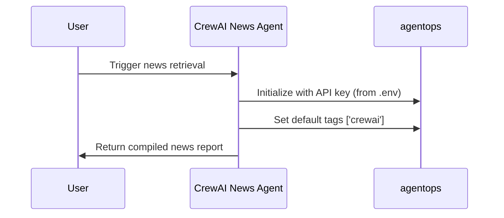
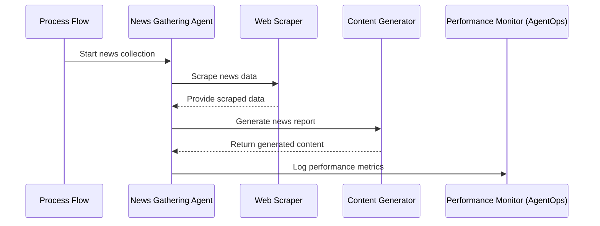

# CrewAI News Agent

A powerful multi-agent AI system designed to autonomously gather, analyze, and generate comprehensive news reports about artificial intelligence. Built using [crewAI](https://crewai.com), this project demonstrates how multiple specialized AI agents can collaborate to perform complex workflows with support for both OpenAI and local Ollama models.

## 🚀 Features

- **Automated News Gathering**: Retrieves the latest AI news from various sources
- **Web Scraping**: Extracts detailed information from relevant websites
- **Content Generation**: Creates well-structured news reports based on gathered data
- **File Management**: Automatically saves reports in markdown format
- **Model Flexibility**: Support for both OpenAI and Ollama models
- **Performance Tracking**: Integration with AgentOps for monitoring agent performance


## 📋 System Architecture





The system consists of four specialized agents working together:


| Agent | Role |
| :-- | :-- |
| News Retriever | Searches for the latest AI news using the SerperDev tool |
| Website Scraper | Extracts detailed content from news sources |
| AI News Writer | Analyzes information and creates comprehensive reports |
| File Writer | Saves the generated content to markdown files |

## 🛠️ Installation

### Prerequisites

- Python >=3.10 <3.13
- [UV](https://docs.astral.sh/uv/) for dependency management
- [Ollama](https://ollama.ai/) (optional, for local model execution)


### Setup

1. Clone the repository:

```bash
git clone https://github.com/Kavirubc/CrewAI-News-Agent.git
cd CrewAI-News-Agent
```

2. Install UV if you haven't already:

```bash
pip install uv
```

3. Install dependencies:

```bash
crewai install
```

4. Add your API keys to the `.env` file:

```
OPENAI_API_KEY=your_openai_api_key
AGENTOPS_API_KEY=your_agentops_api_key
```

5. (Optional) Install and run Ollama for local model execution:

```bash
# Follow Ollama installation instructions at https://ollama.ai/
# Pull the deepseek model
ollama pull deepseek-r1:8b
```


## 🚀 Usage

Run the project from the root folder:

```bash
crewai run
```

This command initializes the AI News Crew, which will:

1. Search for the latest AI news
2. Scrape relevant websites for detailed information
3. Generate a comprehensive news report
4. Save the report as `report.md` in the root folder

## ⚙️ Customization

- **Agents**: Modify `src/ai_news/config/agents.yaml` to adjust agent roles and capabilities
- **Tasks**: Edit `src/ai_news/config/tasks.yaml` to change the workflow and instructions
- **Core Logic**: Update `src/ai_news/crew.py` to add custom tools, LLMs, or processing logic
- **Input Parameters**: Customize `src/ai_news/main.py` to provide specific inputs for your agents
- **Model Selection**: Uncomment the Ollama LLM configuration in `crew.py` to use local models


## 💻 Code Example

The core of the project is the `AiNews` class which orchestrates the multi-agent system:

```python
@CrewBase
class AiNews():
    """AiNews crew"""
    
    agents_config = 'config/agents.yaml'
    tasks_config = 'config/tasks.yaml'
    
    # Uncomment to use Ollama with local models
    # ollama_llm = LLM(
    #     model="ollama/deepseek-r1:8b ",
    #     base_url="http://localhost:11434",
    # )
    
    @agent
    def retrieve_news(self) -> Agent:
        return Agent(
            config=self.agents_config['retrieve_news'],
            tools=[SerperDevTool()],
            verbose=True,
        )
        agentops.init(api_key=os.getenv("AGENTOPS_API_KEY"))
    
    # Additional agents and tasks defined...
    
    agentops.init(default_tags=['crewai'])
    @crew
    def crew(self) -> Crew:
        """Creates the AiNews crew"""
        return Crew(
            agents=self.agents,
            tasks=self.tasks,
            process=Process.sequential,
            verbose=True,
        )
```


## 🔄 Process Flow

1. The News Retriever agent searches for recent AI news using SerperDev
2. The Website Scraper extracts detailed content from the identified sources
3. The AI News Writer analyzes and synthesizes the information
4. The File Writer saves the final report to a markdown file

## 📊 Performance Monitoring

This project integrates with [AgentOps](https://www.agentops.ai/) for monitoring and analyzing agent performance. AgentOps provides insights into:

- Agent execution times
- Task completion rates
- Model performance metrics
- Cost tracking

To enable monitoring, ensure your AgentOps API key is set in the `.env` file.

## 🤝 Contributing

Contributions are welcome! Feel free to submit issues or pull requests to help improve this project.

## 📬 Contact

**Kaviru Hapuarachchi**

- Email: hello@kaviru.cc
- GitHub: [Kavirubc](https://github.com/Kavirubc)


## 🔗 Resources

- [crewAI Documentation](https://docs.crewai.com)
- [crewAI GitHub Repository](https://github.com/joaomdmoura/crewai)
- [Ollama](https://ollama.ai/)
- [AgentOps](https://www.agentops.ai/)
- [Join crewAI Discord](https://discord.com/invite/X4JWnZnxPb)
